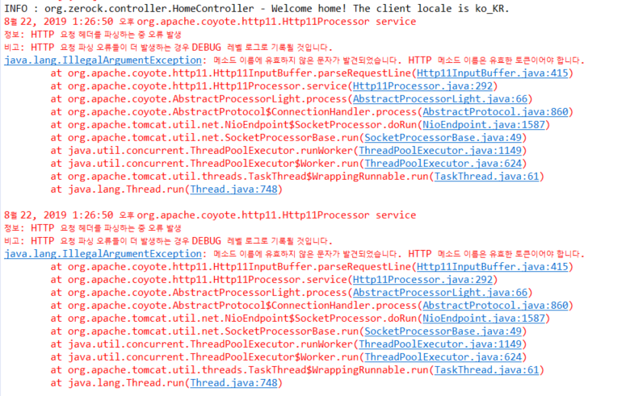
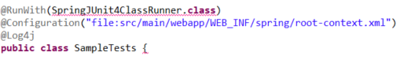
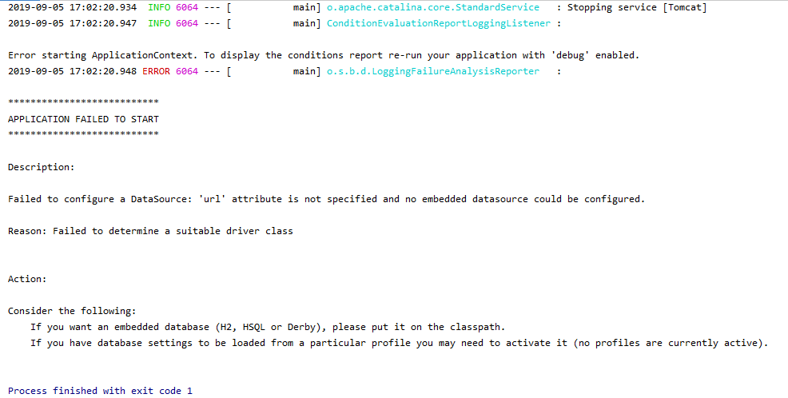
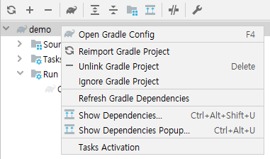

## Intellij에서 gradle과 mariadb를 연결하여 개발환경 구성중



   

```
ERROR_1  
http를 입력해야 하는데 https로 입력하였을 때 발생함.
```




```
ERROR_2  
@RunWith(SpringJUnit4ClassRunner.class) 를 찾지 못하고 에러를 발생할경우 아래와 같은 코드를 추가해줘야 함.  
ContextConfiguration도 마찬가지, 사진속 Configuration은 test용이 아님.
```

```xml
        <dependency>
			<groupId>org.springframework</groupId>
			<artifactId>spring-test</artifactId>
			<version>5.1.1.RELEASE</version>
		</dependency>
```



```
ERROR_3  
gradle이나 maven 라이브러리에  
org.springframework.boot:spring-boot-start-jdbc  또는 data-jpa가 존재하는데
db class path가 입력되지 않았다면 다음과 같은 에러가 발생함.
```

  
```
ERROR_4  
application.properties 설정이 적용안되는 버그를 발견.
분명 refresh아이콘을 클릭하면 gradle에 설정한 파일이 라이브러리에 추가되는대 properties에 설정한건 못읽는다.
구글링해서 찾아보면 Refresh를 하라고 돼있는데 알고보니 아이콘의 기능이 바꼈다.
기존 Refresh가 Reimport이고 Refresh gradle Dependencies를 해야만 properties가 적용된다.   
Reimport하면 jar file은 추가되지만 properties는 적용되지 않는다.

```