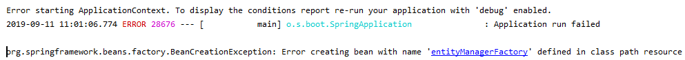
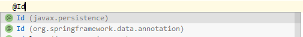
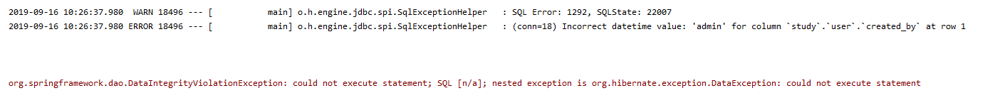

## Intellij에서 gradle과 mariadb를 연결하여 개발환경 구성중


   

```
ERROR_1  
http를 입력해야 하는데 https로 입력하였을 때 발생함.
```

---


```
ERROR_2  
@RunWith(SpringJUnit4ClassRunner.class) 를 찾지 못하고 에러를 발생할경우 아래와 같은 코드를 추가해줘야 함.  
ContextConfiguration도 마찬가지, 사진속 Configuration은 test용이 아님.
```

```xml
        <dependency>
			<groupId>org.springframework</groupId>
			<artifactId>spring-test</artifactId>
			<version>5.1.1.RELEASE</version>
		</dependency>
```


```
ERROR_3  
gradle이나 maven 라이브러리에  
org.springframework.boot:spring-boot-start-jdbc  또는 data-jpa가 존재하는데
db class path가 입력되지 않았다면 다음과 같은 에러가 발생함.
```
---

  
```
ERROR_4  
application.properties 설정이 적용안되는 버그를 발견.
분명 refresh아이콘을 클릭하면 gradle에 설정한 파일이 라이브러리에 추가되는대 properties에 설정한건 못읽는다.
구글링해서 찾아보면 Refresh를 하라고 돼있는데 알고보니 아이콘의 기능이 바꼈다.
기존 Refresh가 Reimport이고 Refresh gradle Dependencies를 해야만 properties가 적용된다.   
Reimport하면 jar file은 추가되지만 properties는 적용되지 않는다.

```
---


```
ERROR_5  
User 클래스를 JPA와 연동하려는데 위와 같은 에러가 발생하였다.  
덕분에 테스트케이스도 돌아가지 않아 하루동안 문제를 찾았다.  
결론은 @Entity를 선언하였을때 식별자를 선언해줘야 하는데 그것을 @Id로 한다.
중요한점은 import org.springframework.data.annotation.Id가 아닌 javax.persistance를 선택해야 한다. 

```




---


```
ERROR_6  
실제 DB와 내가 입력하는 데이터의 포맷이 맞이 않아서 발생하는 에러다.    
Date포맷 NULL을 "0000-00-00"으로 바꾸라는 방법도 찾았지만 되지 않았다.
문제는 CreatedBy에 "admin"을 입력했는데 내가 실수로 DB에는 DateTime으로 설정해서였다.
```